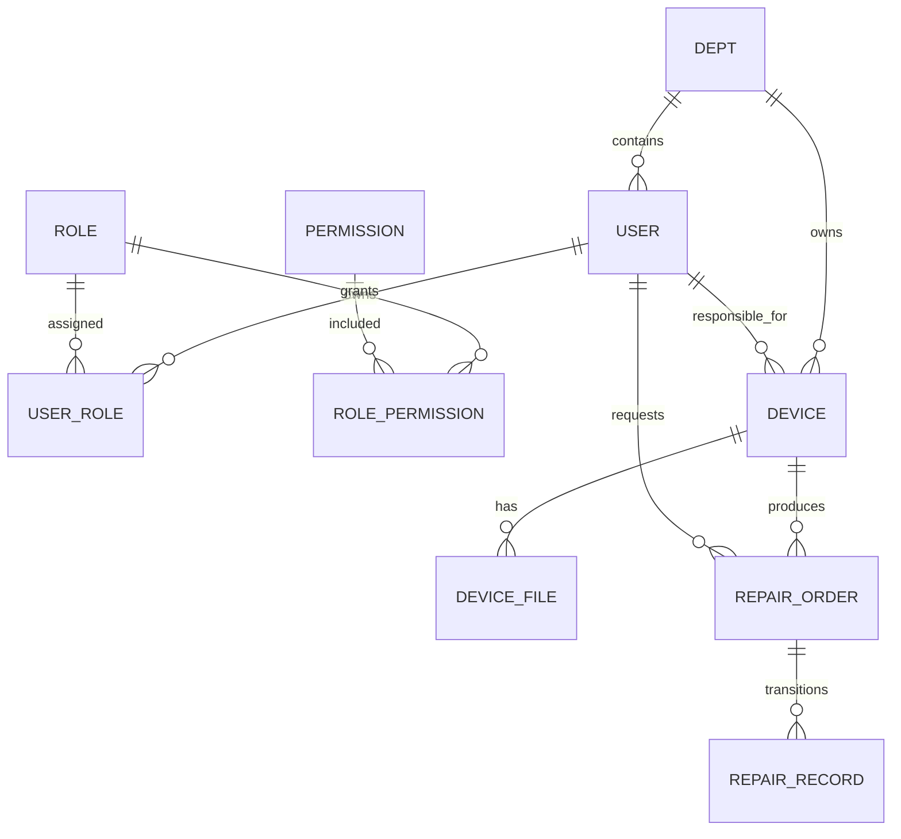

# EquipOps

EquipOps 是一个基于脱敏 TPM（全员生产维护）场景独立重构的设备运维平台，用于练习和展示设备台账、维修工单、权限隔离与维修知识沉淀。仓库不包含原企业源码、真实设备数据或生产凭据，也不表示该系统已在企业生产环境上线。

## 项目范围

### 已完成

- Spring Security 6 + JWT 身份认证与方法级功能权限
- 用户、角色、权限多对多关系与权限变更缓存失效
- Service 层部门级数据隔离及按 ID 越权返回 404
- 设备台账、分页组合查询、文件上传与下载
- Redis 设备详情缓存、空值防穿透、随机 TTL、事务提交后失效
- 工单创建、请求头幂等、Redis 快路径与数据库唯一索引兜底
- DB 条件更新并发接单、显式工单状态机
- 超过 24 小时未接单工单的幂等超时扫描与提交后领域事件日志
- 操作审计基础、Knife4j 接口文档、Logback 滚动文件日志

### 开发中

- RepairMind AI 维修助手：当前完成 FastAPI、模型客户端容错、结构化日志和容器化，RAG 尚未完成
- 前后端工单完整联调
- 审计日志异步化、查询与归档
- Refresh Token、可观测指标、CI 和 Outbox/MQ

### 前端 Mock 展示

`equipops-web` 的部分监控数据、AI 页面和尚未接通的管理页面使用 Mock/Preview 数据。不能将所有前端页面描述为已连接真实后端。

## 技术栈

- Java 17、Spring Boot 3.5、Spring Security 6、MyBatis-Plus、Flyway
- MySQL 8、Redis 7、JWT、Bean Validation、Knife4j/OpenAPI 3
- JUnit 5、Mockito、Testcontainers、Maven Failsafe
- React/Vite 前端；FastAPI RepairMind 独立服务

## 架构与模块边界

```text
Browser / JMeter
       │ HTTP + JWT
       ▼
Security Filter Chain ── 认证、Authorities、401/403
       │
       ▼
Controller ── DTO 白名单与 Bean Validation
       │
       ▼
Service ── 事务、部门隔离、状态机、幂等、并发规则
  │             │                         │
  ▼             ▼                         ▼
MyBatis-Plus   Redis                  Domain Event
  │                                       │ after commit
  ▼                                       ▼
MySQL 8                              structured log

RepairMind(FastAPI:8001) 是独立进程；当前尚未接入 Java 主链路。
```

Java 代码按业务域分为 `auth`、`device`、`order`、`system`，跨域通用能力放在 `common`。目前采用模块化单体，避免在单人项目阶段提前承担服务发现、分布式事务和跨服务排障成本，详见 [ADR-001](docs/adr/ADR-001-modular-monolith.md)。

## 核心数据关系



完整表结构以 [Flyway 迁移](src/main/resources/db/migration)为准，不以图代替数据库约束。

## 工单状态机

```text
PENDING → ACCEPTED → IN_REPAIR → PENDING_CHECK → COMPLETED
   │          │            │            │
   └→ CLOSED  └→ CLOSED     └→ OUTSOURCED└→ IN_REPAIR
                                  │
                                  ├→ PENDING_CHECK
                                  └→ CLOSED
```

状态机先校验合法边，再用“旧状态作为 WHERE 条件”更新，避免并发请求从同一旧状态各自跳转成功。`timed_out` 是待受理工单的附加标记，不是新的业务状态。

## 权限与数据隔离

- JWT 过滤器解析 Token，查询权限码并构造 `GrantedAuthority`。
- Controller 使用 `@PreAuthorize` 做功能权限判断。
- Service 不信任请求中的部门字段，创建时从认证上下文写入部门，查询与按 ID 操作再次校验资源部门。
- 跨部门按 ID 访问返回 404，避免泄漏资源是否存在。

Spring Security 负责认证和功能权限，Service 负责数据范围与业务约束；不能只写成“完整 RBAC”而忽略部门隔离。

## 工单幂等链路

```text
Idempotency-Key + 当前用户 + 请求摘要
           │
           ├─ Redis DONE 命中 ───────────→ 返回原工单
           │
           ├─ Redis SETNX PROCESSING ────→ 继续创建
           │
           └─ Redis 故障/过期 ───────────→ 继续创建
                                             │
                  MySQL UNIQUE(user_id, key) ┤ 最终防线
                                             │
                       重复键当前读 ─────────→ 返回原工单
```

同一用户复用同一键但改变业务字段会返回 409。Redis 只优化快速返回，不能决定幂等正确性，详见 [ADR-015](docs/adr/ADR-015-idempotency.md)。

## 本地启动

前置条件：JDK 17、MySQL 8、Redis 7。完整自动化测试还需要可用的 Docker daemon。

1. 创建空数据库：

```sql
CREATE DATABASE equipops CHARACTER SET utf8mb4 COLLATE utf8mb4_0900_ai_ci;
```

2. 配置环境变量（可参考 [.env.example](.env.example)，Shell 不会自动读取该文件）：

```bash
export MYSQL_PASSWORD='本地MySQL密码'
export REDIS_PASSWORD='本地Redis密码；无密码时设为空字符串'
export JWT_SECRET='至少32字节的本地随机字符串'
```

3. 启动 Java API，Flyway 会从空库执行迁移：

```bash
./mvnw spring-boot:run
```

4. 打开 Knife4j：<http://127.0.0.1:8080/doc.html>。日志同时输出到控制台和 `logs/equipops-api.log`。

注意：种子脚本中除 `admin` 外的密码是公开仓库占位符；公开注册接口当前不会自动分配角色。推荐通过自动化测试验证权限矩阵，或在本地自行准备脱敏账号与角色绑定，不要向仓库提交真实密码。

RepairMind 可单独运行：

```bash
sudo docker compose up -d --build repairmind
curl http://127.0.0.1:8001/health
```

## 测试

```bash
# 纯单元测试（不需要容器）
./mvnw test

# 打包前验收：Surefire 单元测试 + Failsafe 核心集成测试
./mvnw verify

# Day19 性能/并发实验单独执行，不混进稳定回归套件
./mvnw -Dfailsafe.excluded.groups= -Dit.test=OrderLockComparisonBenchmarkIT verify
```

`*IT` 使用 Testcontainers 启动 MySQL 8 和 Redis 7，因此完整的 `verify` 需要 Docker；普通 `test` 只运行纯单元测试。`benchmark` 标签不是跳过的核心测试，而是需要固定环境、独立采样的实验套件。实验方法与原始结果规范见 [docs/benchmark](docs/benchmark/README.md)。

## 日志与监控现状

- Logback：控制台 + 按日期/大小滚动文件，保留 14 天。
- 操作审计：记录操作人、traceId、资源、动作、结果、错误摘要和来源 IP；写日志失败不会覆盖业务结果。
- 工单超时：每轮记录 cutoff、候选数、成功标记数，提交后记录领域事件。
- Actuator、Micrometer、MDC 全链路 traceId 和告警规则仍在规划中，不能宣称已经具备完整生产监控。

## 与学习资料中的旧实现对比

对照表见 [docs/legacy-comparison.md](docs/legacy-comparison.md)。该文档描述的是脱敏学习资料中识别的技术风险与本仓库的独立重构，不是对任何现实企业当前生产系统的审计结论。

## 已知限制

- 超时扫描未引入 ShedLock；多实例会重复扫描候选行，但条件更新保证只有一次生效。规模增大后应加调度锁或任务分片。
- JWT 当前只有 Access Token，没有刷新、主动撤销和服务端会话状态。
- Cache Aside 在数据库提交后到缓存删除之间仍有一致性窗口，删除 Redis 失败目前只有错误暴露，没有可靠补偿队列。
- 操作日志使用同步独立事务，尚未异步化；会增加少量请求延迟。
- Day19 实验脚本已就绪，但仓库不预填未真实采集的性能数字。
- RepairMind 当前是独立的 LLM 客户端骨架，不是完整 RAG 或自主 Agent。
- 根 `docker-compose.yml` 目前只编排 RepairMind，Java/MySQL/Redis 尚未实现一键 Compose 启动。

## 规划

- Day22–25：Token 生命周期、安全测试、测试覆盖、可观测性、最小 Outbox 链路
- Day26–35：RepairMind RAG、引用、评测、租户隔离与 Java 集成
- 完成前后端工单闭环，并将 Mock 页面逐项替换为真实接口
- 在固定环境执行 Day19 三轮实验后，再更新简历中的可验证数字
